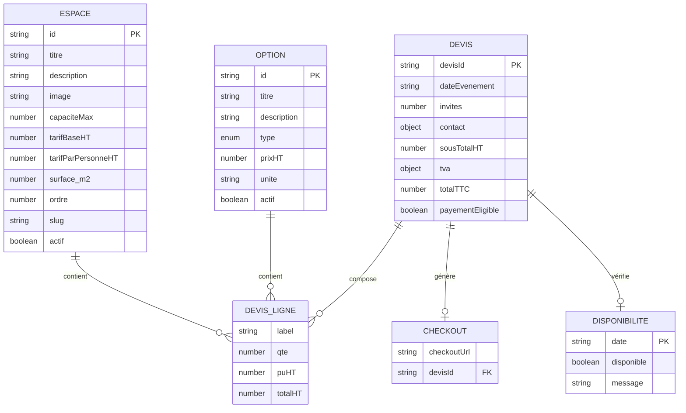

# Schéma des données - Simulation de Devis

## Vue d'ensemble

Ce document présente la structure complète des données utilisées dans le système de simulation de devis événementiel.

---

## Diagramme ERD (Entity-Relationship Diagram)



---

## Structure détaillée des entités

### 1. ESPACE

**Description :** Espace événementiel disponible à la location

**Schéma TypeScript :**
```typescript
interface Espace {
  id: string                    // PK - Identifiant unique (ex: "salle-chai")
  titre: string                  // Nom de l'espace
  description: string            // Description détaillée
  image: string                  // Chemin ASSET (ex: "/ASSET/espaces/chai.jpg")
  capaciteMax?: number           // Capacité maximale en personnes
  tarifBaseHT: number           // Tarif de location de base HT (€)
  tarifParPersonneHT?: number   // Tarif par personne HT si applicable (€)
  surface_m2?: number            // Surface en m²
  ordre?: number                 // Ordre d'affichage
  slug?: string                  // Slug URL-friendly
  actif: boolean                 // Disponibilité (true = actif)
}
```

**Exemple de données :**
```json
{
  "id": "salle-chai",
  "titre": "La Salle du Chai",
  "description": "Située dans l'ancien chai à barriques, cette salle climatisée allie charme intemporel et élégance contemporaine.",
  "image": "/Page/Organiser votre evenement - ok et inclure cta pour renvoyer ver vos événement/salle-de-réception-evenements-familials-professionnels.JPG",
  "capaciteMax": 80,
  "tarifBaseHT": 1200,
  "tarifParPersonneHT": 0,
  "surface_m2": 100,
  "ordre": 1,
  "slug": "salle-chai",
  "actif": true
}
```

**Relations :**
- Un espace peut être utilisé dans plusieurs devis
- Un espace peut avoir plusieurs lignes de devis (si tarif par personne)

---

### 2. OPTION

**Description :** Option supplémentaire configurable pour l'événement

**Schéma TypeScript :**
```typescript
interface Option {
  id: string                              // PK - Identifiant unique (ex: "traiteur-signature")
  titre: string                           // Nom de l'option
  description?: string                     // Description optionnelle
  type: "forfait" | "par_personne" | "par_unite"  // Type de facturation
  prixHT: number                         // Prix unitaire HT (€)
  unite?: "personne" | "unité"            // Unité de facturation
  actif: boolean                          // Disponibilité (true = actif)
}
```

**Exemple de données :**
```json
{
  "id": "traiteur-signature",
  "titre": "Traiteur Signature",
  "description": "Menu 3 services avec produits locaux et vins du domaine",
  "type": "par_personne",
  "prixHT": 35,
  "unite": "personne",
  "actif": true
}
```

**Types d'options :**

| Type | Description | Quantité | Exemple |
|------|-------------|----------|---------|
| `forfait` | Prix fixe quel que soit le nombre | Toujours 1 | Sonorisation (250€) |
| `par_personne` | Prix multiplié par le nombre d'invités | Auto = nombreInvites | Traiteur (35€/personne) |
| `par_unite` | Prix multiplié par quantité choisie | Saisie utilisateur | Visite guidée (150€/unité) |

**Relations :**
- Une option peut être utilisée dans plusieurs devis
- Une option génère une ligne de devis par devis

---

### 3. DEVIS_REQUEST (Payload API)

**Description :** Données envoyées par le client pour calculer un devis

**Schéma TypeScript :**
```typescript
interface DevisRequest {
  dateEvenement: string                // Format ISO: "YYYY-MM-DD"
  invites: number                       // Nombre d'invités (min: 1, max: 1000)
  espaces: string[]                    // Array d'IDs d'espaces sélectionnés
  options: Array<{                     // Options sélectionnées avec quantités
    id: string                         // ID de l'option
    quantite: number                   // Quantité (min: 1)
  }>
  contact?: {                          // Informations de contact (optionnel)
    nom: string
    email: string
    tel: string
  }
}
```

**Exemple de données :**
```json
{
  "dateEvenement": "2025-11-20",
  "invites": 55,
  "espaces": ["salle-chai", "terrasse-sud"],
  "options": [
    { "id": "traiteur-signature", "quantite": 55 },
    { "id": "sono", "quantite": 1 }
  ],
  "contact": {
    "nom": "Dupont",
    "email": "dupont@example.com",
    "tel": "0612345678"
  }
}
```

**Validation Zod :**
```typescript
const DevisRequestSchema = z.object({
  dateEvenement: z.string().regex(/^\d{4}-\d{2}-\d{2}$/),
  invites: z.number().int().min(1).max(1000),
  espaces: z.array(z.string()).min(1),
  options: z.array(z.object({
    id: z.string(),
    quantite: z.number().int().min(1)
  })).optional().default([]),
  contact: z.object({
    nom: z.string().min(1).optional(),
    email: z.string().email().optional(),
    tel: z.string().optional()
  }).optional()
})
```

---

### 4. DEVIS_RESPONSE (Réponse API)

**Description :** Devis calculé retourné par l'API

**Schéma TypeScript :**
```typescript
interface DevisResponse {
  lignes: DevisLigne[]                 // Lignes détaillées du devis
  sousTotalHT: number                  // Sous-total HT (€)
  tva: {
    taux: number                       // Taux TVA (ex: 0.20 = 20%)
    montant: number                    // Montant TVA (€)
  }
  totalTTC: number                     // Total TTC (€)
  devisId: string                      // PK - ID unique du devis (ex: "dv_1699123456789_abc123")
  payementEligible: boolean            // Si le devis peut être payé en ligne
}

interface DevisLigne {
  label: string                         // Libellé de la ligne
  qte: number                          // Quantité
  puHT: number                         // Prix unitaire HT (€)
  totalHT: number                      // Total HT pour cette ligne (€)
}
```

**Exemple de données :**
```json
{
  "lignes": [
    {
      "label": "La Salle du Chai",
      "qte": 1,
      "puHT": 1200,
      "totalHT": 1200
    },
    {
      "label": "Terrasse Sud",
      "qte": 1,
      "puHT": 800,
      "totalHT": 800
    },
    {
      "label": "Traiteur Signature",
      "qte": 55,
      "puHT": 35,
      "totalHT": 1925
    },
    {
      "label": "Sonorisation",
      "qte": 1,
      "puHT": 250,
      "totalHT": 250
    }
  ],
  "sousTotalHT": 4175,
  "tva": {
    "taux": 0.20,
    "montant": 835
  },
  "totalTTC": 5010,
  "devisId": "dv_1699123456789_abc123",
  "payementEligible": true
}
```

**Calcul des lignes :**

1. **Espaces :**
   ```
   totalHT = tarifBaseHT + (tarifParPersonneHT × invites)
   ```

2. **Options (forfait) :**
   ```
   qte = 1
   totalHT = prixHT × 1
   ```

3. **Options (par_personne) :**
   ```
   qte = invites
   totalHT = prixHT × invites
   ```

4. **Options (par_unite) :**
   ```
   qte = quantiteFournie
   totalHT = prixHT × quantiteFournie
   ```

**Calcul des totaux :**
```
sousTotalHT = Σ(lignes[].totalHT)
montantTVA = sousTotalHT × tauxTVA
totalTTC = sousTotalHT + montantTVA
```

---

### 5. CHECKOUT_REQUEST / CHECKOUT_RESPONSE

**Description :** Données pour initialiser le paiement Stripe

**Schéma TypeScript :**
```typescript
interface CheckoutRequest {
  devisId: string                      // FK - ID du devis à payer
}

interface CheckoutResponse {
  checkoutUrl: string                  // URL de redirection Stripe
  devisId: string                      // ID du devis
}
```

**Exemple de données :**
```json
// Request
{
  "devisId": "dv_1699123456789_abc123"
}

// Response
{
  "checkoutUrl": "https://checkout.stripe.com/pay/cs_test_...",
  "devisId": "dv_1699123456789_abc123"
}
```

---

### 6. DISPONIBILITE_RESPONSE

**Description :** Vérification de disponibilité pour une date

**Schéma TypeScript :**
```typescript
interface DisponibiliteResponse {
  date: string                         // Format ISO: "YYYY-MM-DD"
  disponible: boolean                  // Si la date est disponible
  message?: string                     // Message d'information si indisponible
}
```

**Exemple de données :**
```json
// Date disponible
{
  "date": "2025-11-20",
  "disponible": true
}

// Date indisponible
{
  "date": "2025-12-25",
  "disponible": false,
  "message": "Cette date n'est pas disponible. Veuillez choisir une autre date ou nous contacter directement."
}
```

---

## Flux de données

### 1. Création d'un devis

```
[FRONTEND]
  │
  ├─> Saisie: dateEvenement, invites, espaces[], options[]
  │
  └─> POST /api/devis
      │
      ├─> Validation Zod (DevisRequestSchema)
      │
      ├─> Vérification espaces existants et actifs
      │   └─> Si invalide → HTTP 400
      │
      ├─> Vérification options existantes et actives
      │   └─> Si invalide → HTTP 400
      │
      ├─> Calcul lignes espaces
      │   └─> Pour chaque espace: tarifBaseHT + (tarifParPersonneHT × invites)
      │
      ├─> Calcul lignes options
      │   ├─> forfait → qte = 1
      │   ├─> par_personne → qte = invites
      │   └─> par_unite → qte = quantiteFournie
      │
      ├─> Calcul totaux
      │   ├─> sousTotalHT = Σ(lignes)
      │   ├─> montantTVA = sousTotalHT × 0.20
      │   └─> totalTTC = sousTotalHT + montantTVA
      │
      ├─> Génération devisId unique
      │   └─> Format: "dv_" + timestamp + "_" + random
      │
      ├─> Log audit
      │
      └─> Retour DevisResponse
          │
          └─> [FRONTEND] Affichage dans SummaryBlock
```

### 2. Initialisation du paiement

```
[FRONTEND]
  │
  ├─> Clic "Valider et payer l'acompte"
  │
  └─> POST /api/checkout { devisId }
      │
      ├─> Validation Zod (CheckoutRequestSchema)
      │
      ├─> Vérification devis existe et payementEligible
      │   └─> Si invalide → HTTP 400
      │
      ├─> Création session Stripe Checkout (stub)
      │   └─> TODO: Remplacer par vraie intégration Stripe
      │
      ├─> Génération checkoutUrl
      │
      └─> Retour CheckoutResponse { checkoutUrl }
          │
          └─> [FRONTEND] Redirection window.location.href = checkoutUrl
```

### 3. Vérification disponibilité

```
[FRONTEND]
  │
  ├─> Saisie date dans date picker
  │
  └─> GET /api/disponibilites?date=2025-11-20
      │
      ├─> Validation format date
      │
      ├─> Vérification date pas dans le passé
      │
      ├─> Vérification date dans liste indisponibles
      │   └─> TODO: Remplacer par vraie vérification BDD réservations
      │
      └─> Retour DisponibiliteResponse
          │
          └─> [FRONTEND] Affichage InlineNotice si indisponible
```

---

## Relations entre entités

### Schéma relationnel

```
ESPACE (1) ────< (N) DEVIS_LIGNE
OPTION (1) ────< (N) DEVIS_LIGNE
DEVIS (1) ────< (N) DEVIS_LIGNE
DEVIS (1) ────< (1) CHECKOUT
DEVIS (N) ────> (1) DISPONIBILITE (par date)
```

### Cardinalités

| Relation | Cardinalité | Description |
|----------|-------------|-------------|
| ESPACE → DEVIS_LIGNE | 1:N | Un espace peut être dans plusieurs lignes de devis |
| OPTION → DEVIS_LIGNE | 1:N | Une option peut être dans plusieurs lignes de devis |
| DEVIS → DEVIS_LIGNE | 1:N | Un devis contient plusieurs lignes |
| DEVIS → CHECKOUT | 1:1 | Un devis génère un checkout unique |
| DEVIS → DISPONIBILITE | N:1 | Plusieurs devis peuvent vérifier la même date |

---

## Contraintes et règles métier

### Contraintes de validation

1. **Date événement :**
   - Format: `YYYY-MM-DD`
   - Ne peut pas être dans le passé
   - Vérification disponibilité requise

2. **Nombre d'invités :**
   - Minimum: 1
   - Maximum: 1000
   - Entier uniquement

3. **Espaces :**
   - Au moins 1 espace requis
   - Tous les espaces doivent être actifs
   - Vérification capacité totale vs invites (alerte si dépassement)

4. **Options :**
   - Optionnel (peut être vide)
   - Quantité minimum: 1
   - Toutes les options doivent être actives

5. **Contact :**
   - Requis uniquement à l'étape 4
   - Email: format valide
   - Nom: non vide
   - Téléphone: non vide

### Règles de calcul

1. **Calcul espace :**
   ```
   totalHT = tarifBaseHT + (tarifParPersonneHT × invites)
   ```

2. **Calcul option (forfait) :**
   ```
   qte = 1 (automatique)
   totalHT = prixHT × 1
   ```

3. **Calcul option (par_personne) :**
   ```
   qte = invites (automatique)
   totalHT = prixHT × invites
   ```

4. **Calcul option (par_unite) :**
   ```
   qte = quantiteFournieParUtilisateur
   totalHT = prixHT × qte
   ```

5. **Calcul TVA :**
   ```
   tauxTVA = 0.20 (20% - configurable)
   montantTVA = sousTotalHT × tauxTVA
   ```

6. **Calcul total :**
   ```
   totalTTC = sousTotalHT + montantTVA
   ```

### Règles de génération ID

- **devisId :** Format `dv_{timestamp}_{random}`
  - Exemple: `dv_1699123456789_abc123xyz`
  - Timestamp: millisecondes depuis epoch
  - Random: 9 caractères alphanumériques

---

## Configuration

### Variables configurables

| Variable | Valeur actuelle | Emplacement | Description |
|----------|----------------|-------------|-------------|
| `TVA_RATE` | `0.20` (20%) | `app/api/devis/route.ts` | Taux de TVA |
| `DEBOUNCE_DELAY` | `300` ms | `app/evenements/simuler-votre-devis/page.tsx` | Délai debounce calcul |
| `CONTACT_PHONE` | `"+33563570709"` | Page component | Téléphone contact |
| `CONTACT_EMAIL` | `"contact@chateau-lastours.com"` | Page component | Email contact |

### Modifications possibles

1. **TVA :** Modifier `TVA_RATE` dans `app/api/devis/route.ts`
2. **Devise :** Ajouter constante `CURRENCY` et `CURRENCY_SYMBOL`
3. **Acompte minimum :** Ajouter `MIN_ACOMPTE` dans `/api/checkout`
4. **Rate limiting :** Configurer dans middleware

---

## Schéma de base de données (futur)

### Tables proposées

```sql
-- Table ESPACES
CREATE TABLE espaces (
  id VARCHAR(50) PRIMARY KEY,
  titre VARCHAR(255) NOT NULL,
  description TEXT,
  image VARCHAR(500),
  capacite_max INT,
  tarif_base_ht DECIMAL(10,2) NOT NULL,
  tarif_par_personne_ht DECIMAL(10,2) DEFAULT 0,
  surface_m2 INT,
  ordre INT,
  slug VARCHAR(255),
  actif BOOLEAN DEFAULT true,
  created_at TIMESTAMP DEFAULT NOW(),
  updated_at TIMESTAMP DEFAULT NOW()
);

-- Table OPTIONS
CREATE TABLE options (
  id VARCHAR(50) PRIMARY KEY,
  titre VARCHAR(255) NOT NULL,
  description TEXT,
  type ENUM('forfait', 'par_personne', 'par_unite') NOT NULL,
  prix_ht DECIMAL(10,2) NOT NULL,
  unite VARCHAR(50),
  actif BOOLEAN DEFAULT true,
  created_at TIMESTAMP DEFAULT NOW(),
  updated_at TIMESTAMP DEFAULT NOW()
);

-- Table DEVIS
CREATE TABLE devis (
  devis_id VARCHAR(100) PRIMARY KEY,
  date_evenement DATE NOT NULL,
  invites INT NOT NULL,
  contact_nom VARCHAR(255),
  contact_email VARCHAR(255),
  contact_tel VARCHAR(50),
  sous_total_ht DECIMAL(10,2) NOT NULL,
  taux_tva DECIMAL(5,2) DEFAULT 0.20,
  montant_tva DECIMAL(10,2) NOT NULL,
  total_ttc DECIMAL(10,2) NOT NULL,
  payement_eligible BOOLEAN DEFAULT true,
  status ENUM('draft', 'pending', 'paid', 'cancelled') DEFAULT 'draft',
  created_at TIMESTAMP DEFAULT NOW(),
  updated_at TIMESTAMP DEFAULT NOW()
);

-- Table DEVIS_LIGNES
CREATE TABLE devis_lignes (
  id SERIAL PRIMARY KEY,
  devis_id VARCHAR(100) REFERENCES devis(devis_id),
  type ENUM('espace', 'option') NOT NULL,
  reference_id VARCHAR(50) NOT NULL, -- ID espace ou option
  label VARCHAR(255) NOT NULL,
  quantite INT NOT NULL,
  prix_unitaire_ht DECIMAL(10,2) NOT NULL,
  total_ht DECIMAL(10,2) NOT NULL,
  ordre INT,
  created_at TIMESTAMP DEFAULT NOW()
);

-- Table DISPONIBILITES
CREATE TABLE disponibilites (
  date DATE PRIMARY KEY,
  disponible BOOLEAN DEFAULT true,
  raison TEXT,
  created_at TIMESTAMP DEFAULT NOW(),
  updated_at TIMESTAMP DEFAULT NOW()
);

-- Table CHECKOUT_SESSIONS
CREATE TABLE checkout_sessions (
  session_id VARCHAR(255) PRIMARY KEY,
  devis_id VARCHAR(100) REFERENCES devis(devis_id),
  stripe_session_id VARCHAR(255),
  checkout_url VARCHAR(500),
  status ENUM('pending', 'completed', 'expired', 'cancelled') DEFAULT 'pending',
  created_at TIMESTAMP DEFAULT NOW(),
  updated_at TIMESTAMP DEFAULT NOW()
);
```

---

## Exemples de données complètes

### Exemple 1 : Mariage (55 personnes)

**Input :**
```json
{
  "dateEvenement": "2025-11-20",
  "invites": 55,
  "espaces": ["salle-chai", "terrasse-sud"],
  "options": [
    { "id": "traiteur-signature", "quantite": 55 },
    { "id": "sono", "quantite": 1 },
    { "id": "eclairage", "quantite": 1 }
  ]
}
```

**Calcul :**
```
Espaces:
  - Salle du Chai: 1200 + (0 × 55) = 1200 €
  - Terrasse Sud: 800 + (0 × 55) = 800 €

Options:
  - Traiteur Signature: 35 × 55 = 1925 €
  - Sonorisation: 250 × 1 = 250 €
  - Éclairage: 400 × 1 = 400 €

Sous-total HT: 1200 + 800 + 1925 + 250 + 400 = 4575 €
TVA (20%): 4575 × 0.20 = 915 €
Total TTC: 4575 + 915 = 5490 €
```

**Output :**
```json
{
  "lignes": [
    { "label": "La Salle du Chai", "qte": 1, "puHT": 1200, "totalHT": 1200 },
    { "label": "Terrasse Sud", "qte": 1, "puHT": 800, "totalHT": 800 },
    { "label": "Traiteur Signature", "qte": 55, "puHT": 35, "totalHT": 1925 },
    { "label": "Sonorisation", "qte": 1, "puHT": 250, "totalHT": 250 },
    { "label": "Éclairage événementiel", "qte": 1, "puHT": 400, "totalHT": 400 }
  ],
  "sousTotalHT": 4575,
  "tva": { "taux": 0.20, "montant": 915 },
  "totalTTC": 5490,
  "devisId": "dv_1699123456789_abc123",
  "payementEligible": true
}
```

---

## Glossaire

| Terme | Définition |
|-------|------------|
| **HT** | Hors Taxes |
| **TTC** | Toutes Taxes Comprises |
| **TVA** | Taxe sur la Valeur Ajoutée (20%) |
| **PK** | Primary Key (Clé primaire) |
| **FK** | Foreign Key (Clé étrangère) |
| **Debounce** | Délai avant exécution d'une fonction (évite appels multiples) |
| **Stub** | Implémentation temporaire/simulée |

---

**Date de création :** 2025-01-XX  
**Dernière mise à jour :** 2025-01-XX

